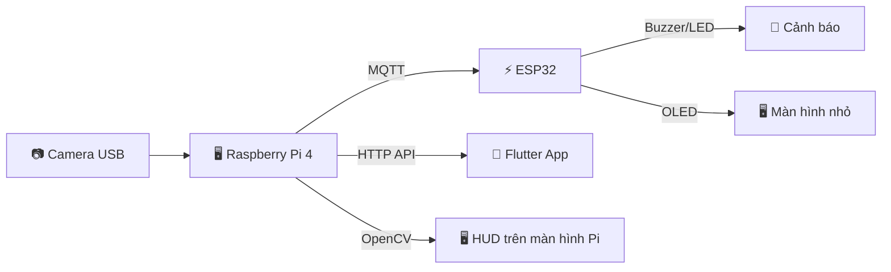

# 📋 HỆ THỐNG NHẬN DIỆN BUỒN NGỦ — TÀI LIỆU ĐẦY ĐỦ A-Z

## 📦 DANH SÁCH FILE NỘP

### Thư mục gốc
| File | Mô tả |
|------|-------|
| `README.md` | Tài liệu tổng quan hệ thống |
| `SYSTEM_DOCUMENTATION.md` | Tài liệu kỹ thuật chi tiết |

### Raspberry Pi — `PI/`
| File | Mô tả |
|------|-------|
| `drowsy_edge.py` | File chính — AI nhận diện buồn ngủ |
| `edge_data_server.py` | HTTP API server cho app Flutter |
| `esp32_wifi_bridge.py` | Cầu nối Serial↔WiFi ESP32→Pi |
| `face_landmarker.task` | Model AI MediaPipe (~4MB) |
| `install_drowsy_edge_service.sh` | Script cài service AI detection |
| `install_edge_data_server_service.sh` | Script cài service HTTP API |
| `install_esp32_wifi_sync_service.sh` | Script cài service WiFi sync |
| `wait_drowsy_prereqs.sh` | Kiểm tra prerequisites trước khi chạy |
| `systemd/drowsy-edge.service` | Systemd unit — AI detection |
| `systemd/edge-data-server.service` | Systemd unit — HTTP API |
| `systemd/esp32-wifi-sync.service` | Systemd unit — WiFi sync |

### ESP32 — `drowsy_esp32/`
| File | Mô tả |
|------|-------|
| `platformio.ini` | Cấu hình PlatformIO (board, thư viện) |
| `src/main.cpp` | Điều khiển chính — MQTT, state machine, buzzer, LED |
| `src/wifi_manager.cpp` | WiFi manager — captive portal, auto-reconnect |
| `src/wifi_manager.h` | Header WiFi manager |
| `src/oled_status.cpp` | Hiển thị OLED 6 màn hình trạng thái |
| `src/oled_status.h` | Header OLED status |
| `src/motion_detector.cpp` | Cảm biến MPU6050 — phát hiện chuyển động |
| `src/motion_detector.h` | Header motion detector |

### Flutter App — `sleepy_app/`
| File | Mô tả |
|------|-------|
| `pubspec.yaml` | Dependencies Flutter |
| `lib/main.dart` | Entry point, theme, login/boot screens |
| `lib/firebase_options.dart` | Cấu hình Firebase |
| `lib/models/sleep_model.dart` | Model dữ liệu trạng thái ngủ |
| `lib/providers/sleep_provider.dart` | State management (ChangeNotifier) |
| `lib/services/auth_service.dart` | Firebase Authentication |
| `lib/services/mqtt_service.dart` | MQTT client — nhận data realtime |
| `lib/services/edge_api_service.dart` | HTTP API client |
| `lib/services/firebase_service.dart` | Firestore cloud storage |
| `lib/services/local_notification_service.dart` | Push notification iOS |
| `lib/screens/home_screen.dart` | Màn hình chính |
| `lib/screens/stats_screen.dart` | Màn hình thống kê |
| `lib/screens/analytics_screen.dart` | Màn hình phân tích |
| `lib/screens/main_tabs_screen.dart` | Tab bar navigation |
| `lib/widgets/animated_indicator.dart` | Vòng tròn trạng thái animated |
| `lib/widgets/status_card.dart` | Card trạng thái + fatigue meter |
| `lib/widgets/glass_card.dart` | Glassmorphism card |
| `lib/widgets/connection_badge.dart` | Badge kết nối |
| `lib/widgets/status_indicator.dart` | Status indicator |
| `lib/widgets/stats_card.dart` | Card thống kê |
| `lib/widgets/chart_widget.dart` | Biểu đồ |
| `lib/database/db_helper.dart` | SQLite local database |

> **Tổng: ~40 file code + 2 file tài liệu + 1 model AI**

---

## 🏗️ Kiến trúc tổng quan



**Luồng hoạt động:**
1. Camera → Pi chạy AI nhận diện mặt (MediaPipe) → tính điểm mệt mỏi
2. Pi gửi MQTT → ESP32 nhận → kích buzzer/LED/OLED cảnh báo
3. Pi gửi HTTP → App Flutter hiển thị realtime trên iPhone

---

## 📁 PHẦN 1: RASPBERRY PI (`~/drowsy_project/`)

### 1.1 Các file chính

| File | Kích thước | Công dụng |
|------|-----------|-----------|
| `drowsy_edge.py` | ~100KB | **File chính** — AI nhận diện buồn ngủ, xử lý camera, tính fatigue, gửi MQTT, hiển thị HUD OpenCV |
| `edge_data_server.py` | ~15KB | HTTP API server — lưu dữ liệu vào SQLite, phục vụ app Flutter đọc trạng thái |
| `esp32_wifi_bridge.py` | ~34KB | Cầu nối Serial↔WiFi — đọc WiFi credentials từ ESP32 qua USB Serial, tự kết nối Pi vào WiFi đó |
| `face_landmarker.task` | ~4MB | **Model AI** (Google MediaPipe) — nhận diện 478 điểm trên mặt |
| `edge_data_server.db` | ~24KB | Database SQLite — lưu lịch sử trạng thái buồn ngủ |

### 1.2 Script cài đặt & tiện ích

| File | Công dụng |
|------|-----------|
| `install_drowsy_edge_service.sh` | Cài service `drowsy-edge` chạy tự động khi Pi bật |
| `install_edge_data_server_service.sh` | Cài service `edge-data-server` HTTP API tự động |
| `install_esp32_wifi_sync_service.sh` | Cài service `esp32-wifi-sync` cầu nối WiFi tự động |
| `wait_drowsy_prereqs.sh` | Kiểm tra Display/WiFi/Camera/MQTT sẵn sàng trước khi chạy |
| `benchmark_metrics.py` | Đo hiệu suất inference |
| `clean_debug.py` | Dọn file debug |
| `realtime_dashboard.py` | Dashboard terminal realtime |

### 1.3 Systemd Services (chạy mặc định khi bật Pi)

| Service | File | Mô tả |
|---------|------|-------|
| `drowsy-edge.service` | Chạy `drowsy_edge.py` | AI nhận diện + MQTT + HUD — khởi động sau WiFi + MQTT + Camera sẵn sàng |
| `edge-data-server.service` | Chạy `edge_data_server.py` | HTTP API cho app Flutter |
| `esp32-wifi-sync.service` | Chạy `esp32_wifi_bridge.py` | Đọc WiFi từ ESP32 Serial → kết nối Pi |

### 1.4 Cách cài đặt trên Pi (từ A-Z)

```bash
# ═══ BƯỚC 1: Cài dependencies hệ thống ═══
sudo apt update && sudo apt install -y \
  python3-pip python3-opencv \
  mosquitto mosquitto-clients \
  network-manager wireless-tools

# ═══ BƯỚC 2: Cài thư viện Python ═══
pip3 install mediapipe paho-mqtt numpy pyserial

# ═══ BƯỚC 3: Cấu hình MQTT Broker (Mosquitto) ═══
# Cho phép kết nối từ ESP32 và App (không cần password)
sudo tee /etc/mosquitto/conf.d/drowsy.conf > /dev/null <<EOF
listener 1883 0.0.0.0
allow_anonymous true
EOF
sudo systemctl restart mosquitto
sudo systemctl enable mosquitto

# ═══ BƯỚC 4: Copy file lên Pi ═══
# Từ Mac:
scp -r /Users/tolinh/drowsy/PI/* pi@raspberrypi.local:~/drowsy_project/

# ═══ BƯỚC 5: Đảm bảo model AI có mặt ═══
ls ~/drowsy_project/face_landmarker.task  # phải tồn tại (~4MB)

# ═══ BƯỚC 6: Cài 3 services chạy tự động khi bật Pi ═══
cd ~/drowsy_project

# Service 1: WiFi Sync (chạy đầu tiên — đọc WiFi từ ESP32)
sudo bash install_esp32_wifi_sync_service.sh

# Service 2: AI Detection (chạy sau WiFi + MQTT + Camera sẵn sàng)
sudo bash install_drowsy_edge_service.sh

# Service 3: HTTP API cho app Flutter
sudo bash install_edge_data_server_service.sh

# ═══ BƯỚC 7: Kiểm tra tất cả services ═══
sudo systemctl status drowsy-edge
sudo systemctl status edge-data-server
sudo systemctl status esp32-wifi-sync
```

### 1.5 Chạy thủ công (không dùng service)

```bash
# Chạy AI detection thủ công (có preview camera)
cd ~/drowsy_project && python3 drowsy_edge.py

# Chạy không có preview (headless)
cd ~/drowsy_project && python3 drowsy_edge.py --no-preview

# Chạy HTTP API server thủ công
cd ~/drowsy_project && python3 edge_data_server.py

# Chạy WiFi bridge thủ công
cd ~/drowsy_project && sudo python3 esp32_wifi_bridge.py
```

### 1.6 Quản lý services

```bash
# Xem log realtime
sudo journalctl -fu drowsy-edge

# Stop/Start/Restart
sudo systemctl stop drowsy-edge
sudo systemctl start drowsy-edge
sudo systemctl restart drowsy-edge

# Tắt tự động khi boot
sudo systemctl disable drowsy-edge

# Bật lại tự động
sudo systemctl enable drowsy-edge
```

### 1.6 Nguyên lý AI trong `drowsy_edge.py`

```
Camera (30fps, 224×168) 
    → MediaPipe Face Landmarker (478 điểm mặt)
    → Tính toán:
        • EAR (Eye Aspect Ratio) — mắt nhắm/mở
        • MAR (Mouth Aspect Ratio) — ngáp
        • Head Pose (yaw/pitch/roll) — nghiêng/cúi đầu
        • Gaze direction — hướng nhìn
    → Tính điểm Fatigue (0-100):
        • Mắt nhắm lâu → +điểm
        • Ngáp → +điểm
        • Đầu cúi → +điểm
        • Mắt mở + nhìn thẳng → -điểm (hồi phục)
    → Phân loại:
        • fatigue < 18  → ATTENTIVE
        • fatigue 18-42 → AWAKE  
        • fatigue 42-62 → TIRED
        • fatigue 62-80 → VERY_TIRED
        • fatigue > 80  → DROWSY
        • mắt nhắm >2s → MICROSLEEP
    → Gửi MQTT topic "driver/status"
```

### 1.7 Calibration (nhìn thẳng 30 giây)

- Khi bật hệ thống, người lái phải **nhìn thẳng camera 30 giây liên tục**
- Hệ thống đo baseline EAR/MAR/Head pose của người đó
- Sau 30s → `armed = true` → bắt đầu nhận diện thật
- Nếu quay đi giữa chừng → reset, đếm lại từ đầu
- Cấu hình: `PI_ARM_GATE_ENABLED = True` (bật/tắt)

### 1.8 HUD hiển thị trên màn hình Pi

- **Glassmorphism panel** — hiển thị trạng thái, fatigue, FPS
- **Corner bracket** — khung nhận diện mặt
- **Calibration overlay** — vòng tròn progress + đếm ngược 30s
- **Danger vignette** — viền đỏ pulsing khi DROWSY/SLEEP
- Cửa sổ: "Drowsy Monitor"

---

## ⚡ PHẦN 2: ESP32 (`/src/`)

### 2.1 Các file source

| File | Kích thước | Công dụng |
|------|-----------|-----------|
| `main.cpp` | ~71KB | **Điều khiển chính** — MQTT client, state machine, buzzer/LED, alert engine, OLED update |
| `wifi_manager.cpp/h` | ~38KB | Quản lý WiFi — captive portal, lưu credentials, auto-reconnect |
| `oled_status.cpp/h` | ~20KB | Hiển thị OLED — 6 màn hình trạng thái (boot, connecting, calibration, active, alert, rest) |
| `motion_detector.cpp/h` | ~5.5KB | Cảm biến MPU6050 — phát hiện xe đang di chuyển hay đứng yên |

### 2.2 Phần cứng & chân kết nối

| Chân GPIO | Thiết bị | Mô tả |
|-----------|----------|-------|
| GPIO 22 | LED xanh | Đèn trạng thái |
| GPIO 23 | Active Buzzer | Còi chủ động (bíp bíp) |
| GPIO 25 | Passive Speaker | Loa thụ động (phát tone tần số) |
| GPIO 26 | OLED SDA | Màn hình I2C data |
| GPIO 27 | OLED SCL | Màn hình I2C clock |
| GPIO 0 | Nút BOOT | Nhấn giữ 5s → reset WiFi |

### 2.3 📢 Các tiếng kêu báo hiệu

| Tiếng kêu | Khi nào | Pattern |
|------------|---------|---------|
| **Startup beep** | ESP32 vừa bật nguồn | 1 tiếng bíp ngắn |
| **Pi Ready beep** | Kết nối Pi thành công | 2 tiếng bíp ("tít tít") |
| **Face Detected beep** | Phát hiện mặt ổn định >1.2s | 2 tiếng bíp nhẹ ("tip tip") |
| **Driving Double beep** | Xe bắt đầu di chuyển (DRIVING state) | 2 tiếng bíp kép |
| **Tired Slow beep** | Mệt mỏi (TIRED) | Bíp chậm, ngắt quãng |
| **Sleepy Fast beep** | Buồn ngủ (SLEEPY) | Bíp nhanh liên tục |
| **Sleep Continuous** | Ngủ gật (SLEEP) — **NGUY HIỂM** | Buzzer kêu liên tục + speaker tone 2200Hz, tối đa 5 giây |

### 2.4 Màn hình OLED (6 trang)

| Trang | Khi nào | Nội dung |
|-------|---------|----------|
| **Boot Splash** | Khởi động (2 giây đầu) | Logo "DROWSY MONITOR" + animation |
| **Connecting** | Chờ WiFi/MQTT/Pi | Trạng thái WiFi ✓/✗, MQTT ✓/✗, Pi ✓/✗ + IP addresses |
| **Calibration** | Đang calibrate 30s | "NHIN THANG" + progress bar + phần trăm |
| **Active** | Đang nhận diện | "DANG NHAN DIEN" + "AN TOAN" + Pi IP + pulsing dot |
| **Drowsy Alert** | Phát hiện ngủ gật | ⚠ "BUON NGU!" inverted flash |
| **Rest Warning** | Ngủ gật nhiều lần | ⚠ "CAN NGHI NGOI" |

### 2.5 State Machine ESP32

```
SAFE → DRIVING → TIRED → SLEEPY → SLEEP
  ↑                                   |
  └───────────────────────────────────┘

SAFE:    Xe chưa di chuyển / mọi thứ bình thường
DRIVING: Xe đang di chuyển, tài xế tỉnh táo
TIRED:   Bắt đầu mệt (fatigue 42-62)
SLEEPY:  Buồn ngủ (fatigue 62-80)  
SLEEP:   Ngủ gật! (fatigue >80 hoặc mắt nhắm >2s)
```

### 2.6 WiFi Manager — Captive Portal

- ESP32 bật nguồn lần đầu → tạo WiFi hotspot `DROWSY-SETUP-xxxx`
- Điện thoại kết nối vào → mở trang web cấu hình
- Nhập WiFi SSID + Password → ESP32 lưu + kết nối
- Thông tin WiFi được gửi qua Serial → Pi tự kết nối cùng WiFi
- **Nhấn giữ nút BOOT 5 giây** → reset WiFi, mở lại captive portal

### 2.7 Cách flash firmware ESP32

```bash
# Từ Mac (PlatformIO)
cd /Users/tolinh/Documents/PlatformIO/Projects/drowsy_esp32

# Build
pio run

# Flash lên ESP32 (cắm USB)
pio run -t upload

# Xem Serial monitor
pio device monitor
```

### 2.8 Thư viện sử dụng (`platformio.ini`)

| Thư viện | Công dụng |
|----------|-----------|
| PubSubClient | MQTT client |
| ArduinoJson | Parse JSON từ Pi |
| Adafruit MPU6050 | Cảm biến gia tốc (motion) |
| Adafruit SSD1306 | Driver OLED 128×64 |
| Adafruit SH110X | Driver OLED backup |
| Adafruit GFX | Thư viện đồ họa OLED |

---

## 📱 PHẦN 3: FLUTTER APP (`sleepy_app/`)

### 3.1 Cấu trúc file

```
lib/
├── main.dart                    # Entry point, theme, login/boot screens
├── firebase_options.dart        # Cấu hình Firebase
├── models/
│   └── sleep_model.dart         # Model: SleepState, SleepRecord
├── providers/
│   └── sleep_provider.dart      # State management (ChangeNotifier)
├── services/
│   ├── auth_service.dart        # Firebase Authentication
│   ├── mqtt_service.dart        # MQTT client — nhận data realtime từ Pi
│   ├── edge_api_service.dart    # HTTP API — lấy data từ edge_data_server
│   ├── firebase_service.dart    # Firestore — lưu cloud
│   └── local_notification_service.dart  # Push notification iOS
├── screens/
│   ├── home_screen.dart         # Màn hình chính — trạng thái + indicator
│   ├── stats_screen.dart        # Thống kê lịch sử
│   ├── analytics_screen.dart    # Phân tích chi tiết
│   └── main_tabs_screen.dart    # Tab bar navigation (Home/Stats/Analytics)
├── widgets/
│   ├── animated_indicator.dart  # Vòng tròn trạng thái animated (orbit rings + icon)
│   ├── status_card.dart         # Card trạng thái chính + fatigue meter
│   ├── glass_card.dart          # Glassmorphism card component
│   ├── connection_badge.dart    # Badge trạng thái kết nối
│   ├── status_indicator.dart    # Indicator nhỏ
│   ├── stats_card.dart          # Card thống kê
│   └── chart_widget.dart        # Biểu đồ
└── database/
    └── db_helper.dart           # SQLite local — lưu offline
```

### 3.2 Các màn hình app

| Màn hình | Mô tả |
|----------|-------|
| **Boot Screen** | Loading animation khi khởi động |
| **Login Screen** | Đăng nhập Firebase (email/password) |
| **Home** | Trạng thái realtime: indicator animated, fatigue bar, confidence, status pills |
| **Stats** | Lịch sử buồn ngủ theo ngày/tuần |
| **Analytics** | Phân tích sâu: thời gian lái, xu hướng mệt mỏi |

### 3.3 Kết nối App ↔ Pi

- **MQTT** (realtime): App subscribe topic `driver/status` → nhận trạng thái ~10 lần/giây
- **HTTP API** (lịch sử): App gọi `http://raspberrypi.local:8080/api/...` → lấy dữ liệu SQLite

### 3.4 Deploy lên iPhone

```bash
cd /Users/tolinh/drowsy/sleepy_app

# Build release
flutter build ios --release

# Cài lên iPhone (cắm USB + pair trong Xcode)
# Mở Xcode → chọn iPhone → nhấn ▶ Run
open ios/Runner.xcworkspace
```

---

## 🔌 PHẦN 4: GIAO TIẾP MQTT

### 4.1 Topics

| Topic | Publisher | Subscriber | Nội dung |
|-------|----------|------------|----------|
| `driver/status` | Pi | ESP32, App | Trạng thái AI: state, fatigue, confidence, EAR, MAR |
| `driver/esp32_telemetry` | ESP32 | App | Telemetry ESP32: WiFi, battery, uptime |
| `driver/control` | App | ESP32 | Lệnh điều khiển (reset, config) |

### 4.2 Payload mẫu `driver/status`

```json
{
  "status": "AWAKE",
  "fatigue": 25,
  "confidence": 0.85,
  "ear": 0.28,
  "mar": 0.15,
  "yaw": 2.1,
  "pitch": -1.5,
  "no_face": false,
  "face_lock": true,
  "armed": true,
  "arm_progress": 100,
  "ts": 1714742400000
}
```

---

## 🔧 PHẦN 5: CẤU HÌNH QUAN TRỌNG

### 5.1 Pi (`drowsy_edge.py`)

| Cấu hình | Giá trị | Mô tả |
|-----------|---------|-------|
| `PI_ARM_GATE_ENABLED` | `True` | Bắt buộc calibrate 30s trước khi nhận diện |
| `DRIVING_CONFIRM_LOOK_STRAIGHT_MS` | `30000` | Thời gian nhìn thẳng (30s) |
| `MQTT_BROKER` | `127.0.0.1` | Địa chỉ MQTT broker (localhost) |
| `CAMERA_SOURCE` | `0` | Camera index (USB camera) |

### 5.2 ESP32 (`main.cpp`)

| Cấu hình | Giá trị | Mô tả |
|-----------|---------|-------|
| `ENABLE_DRIVING_ARM_GATE` | `true` | Bật calibrate gate |
| `ENABLE_STARTUP_BEEP_ON_BOOT` | `true` | Bíp khi bật nguồn |
| `SLEEP_ALARM_MAX_MS` | `5000` | Buzzer kêu tối đa 5s khi SLEEP |
| `WIFI_RESET_HOLD_MS` | `5000` | Nhấn giữ 5s reset WiFi |
| `OLED_REFRESH_MS` | `120` | Tốc độ refresh OLED |

---

## 📦 PHẦN 6: THỨ TỰ KHỞI ĐỘNG

```
1. ESP32 bật nguồn
   → Startup beep (bíp 1 tiếng)
   → OLED: Boot Splash (2s)
   → Kết nối WiFi (từ credentials đã lưu)
   → OLED: Connecting (hiện WiFi/MQTT/Pi status)

2. Pi bật nguồn
   → esp32-wifi-sync.service khởi động
   → Đọc WiFi từ ESP32 Serial → Pi kết nối WiFi
   → drowsy-edge.service khởi động
   → Chờ: Display → WiFi → Camera → MQTT (wait_drowsy_prereqs.sh)
   → Chạy drowsy_edge.py
   → edge-data-server.service khởi động

3. Kết nối ESP32 ↔ Pi
   → MQTT handshake
   → ESP32 OLED: Connecting → tất cả ✓
   → Pi Ready beep (tít tít)

4. Calibration (30 giây)
   → OLED: "NHIN THANG" + progress bar
   → Pi HUD: vòng tròn progress + đếm ngược
   → Người lái nhìn thẳng 30s liên tục
   → armed = true

5. Nhận diện hoạt động
   → OLED: "DANG NHAN DIEN - AN TOAN"
   → Pi HUD: corner brackets + fatigue bar
   → App: realtime indicator

6. Phát hiện buồn ngủ
   → OLED: "BUON NGU!" flash
   → Buzzer: kêu liên tục
   → LED: nhấp nháy
   → App: alert dialog + haptic
   → Pi HUD: danger vignette đỏ
```

---

## 🛠️ PHẦN 7: XỬ LÝ SỰ CỐ

| Sự cố | Giải pháp |
|--------|-----------|
| ESP32 không kết nối WiFi | Nhấn giữ nút BOOT 5s → reset → cấu hình lại WiFi |
| Pi không thấy camera | Kiểm tra `ls /dev/video0` — cắm lại USB camera |
| MQTT không kết nối | `sudo systemctl restart mosquitto` |
| App không nhận data | Kiểm tra Pi và iPhone cùng WiFi |
| OLED không hiện | Kiểm tra dây SDA (GPIO 26), SCL (GPIO 27), địa chỉ I2C 0x3C |
| Buzzer không kêu | Kiểm tra GPIO 23, buzzer active-low (GND kích hoạt) |

---

> **Bundle ID App:** `com.tolinh.drowsyMonitor`
> **MQTT Client ID:** `esp32-drowsy-alert`
> **ESP32 Board:** ESP32 DevKit V1 (240MHz, 320KB RAM, 4MB Flash)
> **RAM usage:** 14.5% | **Flash usage:** 68.0%
